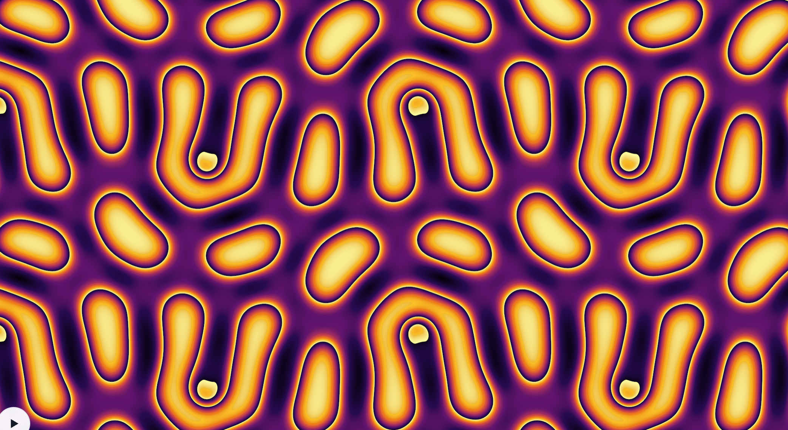
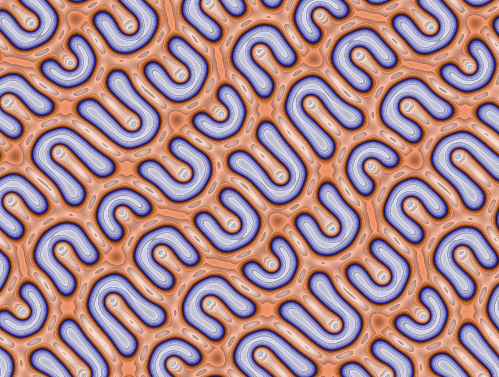

# Gray–Scott: from time symmetry to looping patterns

User messages, assistant replies, and progress updates from September 4–5, 2026, through the request to publish this transcript. Tool logs and private runtime instructions are omitted. Automatic browser context and attachment wrappers are removed; structured question replies are formatted for reading. Local links are rewritten to public copies or the corresponding live pages. Earlier reports are preserved as written, including findings that were superseded later in the conversation.

## User · 2026-09-04T20:54:16.712Z

Here's some context "Btw a neat application of wallpaper symmetry is differential equations. 
satisfy reaction-diffusion equations locally, while globally  it has a symmetry of a wallpaper group. You often get structures like gliders from in Conway's Game of Life
[[https://bulatov.org/symsim/240103\_JMM/index.html#(1)\](https://bulatov.org/symsim/240103\_JMM/index.html#(1\\))](https://bulatov.org/symsim/240103_JMM/index.html#\(1\)]\(https://bulatov.org/symsim/240103_JMM/index.html#\(1\\\)\))
Something that's been on my mind recently, can it be extended to time symmetry?
Looping animation where the right side of the solution is a mirror-reflected version of the left side but with a time shift. ". Specifically, I want you to take clockwork symmetry 442 which has 6 symmetries that interpret as time symmetries ([https://yaroslavvb.github.io/animated-groups-fable/correspondence-p4.html#g94](https://yaroslavvb.github.io/animated-groups-fable/correspondence-p4.html#g94)), and develop a solver that can find periodic solutions that also satisfy time symmetries. First, decide on the feasibility of finding the periodic solutions with the symmetries of the six different groups. Then create a section ("scott-gray") which focuses on 442 groups specifically, and allows me to view the animations in the browser. The original symmetric Gray-Scott are also implemented in [https://github.com/vbulatov2011/symhub/tree/main/apps/symsim/gray\_scott](https://github.com/vbulatov2011/symhub/tree/main/apps/symsim/gray_scott), I especially like the gliders attached, Prefer animations for patterns like this.

## Assistant · progress update · 2026-09-04T20:54:21.748Z

I’ll check the six 442 time-symmetry actions and their compatibility with Gray–Scott dynamics, then build a `scott-gray` browser section with animation playback and a periodic-orbit solver. I’ll use the attached gliders as visual references and report numerical evidence separately from symmetry-only demonstrations.

## Assistant · progress update · 2026-09-04T20:54:50.132Z

The six groups in your correspondence are forward time symmetries, so they are compatible with autonomous Gray–Scott dynamics. A separate issue is whether a chosen parameter set produces a nonstationary orbit with the required timing; simply replaying a rotated pattern would not establish that. I’m checking the exact phase shifts and glider parameters before choosing the solver constraints.

## Assistant · progress update · 2026-09-04T20:56:07.610Z

All six are algebraically feasible, including the two with a half-cell translation coupled to a half-period shift. There is one useful constraint: a whole 442 pattern cannot drift rigidly in a single direction. The promising targets are coordinated local gliders, rotating packets, and breathing worms. The page will let you compare those symmetry patterns, evolve the actual equations, and search for a periodic orbit with measured errors.

## Assistant · progress update · 2026-09-04T20:59:10.403Z

I found Bulatov’s actual U-skate preset: feed \(F=0.062\), kill \(k=0.0609\). It uses a reactive background, which is important for reproducing those shapes. The solver now has exact constraints for all six groups, and its gradient and symmetry tests pass. I’m connecting it to the viewer and testing real trajectories for recurrence.

## Assistant · progress update · 2026-09-04T21:02:56.524Z

The first searches reduced the PDE residual, but the glider candidates did not close under independent forward integration. They’ll remain labelled “unverified.” I also found a genuine periodic chemical oscillator to test the solver’s acceptance path; it is spatially uniform, so it is a verification case rather than a glider result. The browser preview is open while I finish the controls and numerical checks.

## Assistant · progress update · 2026-09-04T21:07:12.188Z

There is now a genuine animated 442 spiral trajectory to view, using the same five-point Gray–Scott equations as the new solver. It has the curled shapes from your references, but it is a transient rather than a verified loop. I’m adding it alongside the six exact symmetry previews and the source U-skate seed, so the distinction is visible in the page itself.

## Assistant · progress update · 2026-09-04T21:09:49.486Z

The page is ready. It includes the real spiral trajectory, all six symmetry previews, the U-skate seed, and browser and command-line solvers. Twelve numerical tests pass, and I checked playback, search, evolution, and navigation in the browser. I’m opening the finished page on the real spiral example; the page clearly reports that no nonuniform periodic glider orbit has been verified yet.

## Assistant · 2026-09-04T21:10:13.934Z

Implemented and opened the [Scott–Gray laboratory](https://yaroslavvb.github.io/animated-groups-fable/scott-gray/).

- All six 442 groups are compatible with Gray–Scott dynamics.
- Includes real spiral evolution, six symmetry previews, Bulatov’s U-skate seed, and a periodic-orbit solver.
- Twelve numerical tests pass.

**No nonuniform periodic glider orbit has been verified yet.** The initial searches failed independent return checks; the page labels these honestly.

[Feasibility analysis](https://yaroslavvb.github.io/animated-groups-fable/scott-gray-feasibility.md) · [Solver documentation](https://yaroslavvb.github.io/animated-groups-fable/scott-gray/SOLVER.md)

Changes are local; GitHub Pages has not been published.

## User · 2026-09-04T21:10:27.555Z

push to github

## Assistant · progress update · 2026-09-04T21:10:30.243Z

I’ll check the changes and Git status, then commit and push the Scott–Gray section to GitHub.

## Assistant · progress update · 2026-09-04T21:11:01.873Z

GitHub has 25 newer commits, including navigation changes. I’ll integrate those first, then push and verify the GitHub Pages deployment.

## Assistant · progress update · 2026-09-04T21:12:30.318Z

The changes are rebased onto the latest `main`. The mobile check and all 12 solver tests pass. The repository’s full animation verification is still running; I’ll push once it finishes.

## Assistant · progress update · 2026-09-04T21:13:25.316Z

Pushed to `main` as `d9a864f`. All checks passed. GitHub Pages is deploying the commit; I’ll verify the live page before finishing.

## Assistant · 2026-09-04T21:14:11.311Z

Pushed to `main` as `d9a864f`. GitHub Pages deployment succeeded and the live page is verified.

[Open Scott–Gray laboratory](https://yaroslavvb.github.io/animated-groups-fable/scott-gray/)

## User · 2026-09-04T21:21:34.536Z

Overlay generators there, same generators as in the [https://yaroslavvb.github.io/animated-groups-fable/correspondence-p4.html](https://yaroslavvb.github.io/animated-groups-fable/correspondence-p4.html) page, and also reuse same chaim short color notation rather than clockwork notation. Use same approach as Vladimir bulatov's symsym repo where he uses webgl to accelerate (look at [https://github.com/vbulatov2011/symhub/tree/main/apps/symsim](https://github.com/vbulatov2011/symhub/tree/main/apps/symsim) how he did it). I want to be able to adjust parameters, and give me some way to select to restrict parameters to only working solutions. I basically want to quickly Explore the space of all possible solutions, and some of them may be impossible. Maybe we use some of the existing presets that Vladimir used.

## Assistant · progress update · 2026-09-04T21:21:38.469Z

I’ll reuse the generator overlays and Chaim notation from the correspondence page, then add WebGL evolution and Bulatov presets for faster exploration. I’ll make “working solutions” an explicit filter, distinguishing presets that sustain visible patterns from candidates that pass periodicity checks.

## Assistant · 2026-09-04T21:22:15.758Z

For the “working solutions only” filter, should the default mean parameters tested to produce moving patterns, or only numerically verified periodic solutions with the selected time symmetry?
- Tested moving patterns, with a separate strict periodic filter
- Only verified periodic solutions, even if the list is empty

## User · 2026-09-04T21:24:23.231Z

**Question shown:** For the “working solutions only” filter, should the default mean parameters tested to produce moving patterns, or only numerically verified periodic solutions with the selected time symmetry?

**Answer:** Only verified periodic solutions, even if the list is empty

## Assistant · progress update · 2026-09-04T21:24:45.949Z

Understood—the default filter will show only numerically verified periodic solutions for the selected symmetry. If none exist, it will show an empty result. Bulatov presets and moving-pattern tests will be available in exploration modes, without counting as verified periodic solutions.

## Assistant · progress update · 2026-09-04T21:26:06.618Z

The GPU solver is working and matches the CPU calculation closely in both stencil modes. I’m now connecting it to the controls, the reference generator overlays, and the strict periodic-only filter; that filter will initially be empty because none of the existing patterned examples have passed periodic verification.

## Assistant · progress update · 2026-09-04T21:28:36.183Z

The preset catalog now contains all 81 of Bulatov’s named parameter pairs. Separate tests across the six groups found moving patterns, stationary patterns, and decayed seeds—useful guides for exploration, but none qualify for the periodic-only list. The interface will keep those distinctions visible and let you change the live chemistry directly.

## Assistant · progress update · 2026-09-04T21:30:42.836Z

The new controls and overlays are connected. I’m testing the full browser workflow now: the empty strict filter, live parameter changes, preset snapping, and recording a candidate for the periodic solver.

## Assistant · progress update · 2026-09-04T21:32:17.412Z

Browser checks confirmed that the GPU animation, generator selection, and preset restrictions work. I also caught a few edge cases: some source presets use more decimal places than the old inputs allowed, and the refined periodic check needs to halve the actual integration timestep. I’m fixing those before publishing.

## Assistant · progress update · 2026-09-04T21:33:43.187Z

A short end-to-end search completed correctly: it produced a candidate, failed the independent checks, and stayed out of the verified-only list. GPU and CPU rendering also agree at tile seams, so the overlaid generators line up with the numerical fields. I’m finishing mobile checks and deployment validation.

## Assistant · progress update · 2026-09-04T21:35:42.813Z

The numerical tests and repository symmetry checks pass. The mobile layout has no horizontal overflow, and the nearby-parameter screen is producing selectable results with explicit “moving,” “stationary,” or “decayed” labels. I’m preparing the commit and will verify the deployed GitHub Pages version.

## User · 2026-09-04T21:36:06.079Z

Also, next time you give me a preview, host it locally and give me link on a local webserver available through tailscale (It's currently running as set up through Claude). I basically want a link I can click on any device on Tailscale.

## Assistant · progress update · 2026-09-04T21:36:14.862Z

I’ll use the existing Tailscale setup for future previews and provide a link you can open from any device on your tailnet. I’m checking that address now and saving this preference in the repository.

## Assistant · progress update · 2026-09-04T21:36:36.133Z

Your Tailscale preview is available at [Scott–Gray on your local server](https://yaroslavvb.github.io/animated-groups-fable/scott-gray/). I verified that address responds with the updated page and saved the preference for future previews.

## Assistant · progress update · 2026-09-04T21:38:38.120Z

The changes are pushed to GitHub. The local Tailscale preview is ready; I’m waiting for the final Pages deployment and checking that it serves the updated controls and GPU solver.

## Assistant · 2026-09-04T21:39:14.170Z

Implemented and pushed: exact generator overlays, Chaim notation, WebGL acceleration, live parameters, 81 presets, and nearby-parameter screening.

The verified-periodic-only filter defaults to empty. Numerical, GPU, and mobile checks passed.

Saved your Tailscale preference. [Open the local preview](https://yaroslavvb.github.io/animated-groups-fable/scott-gray/).

[Published Scott–Gray laboratory](https://yaroslavvb.github.io/animated-groups-fable/scott-gray/)

## User · 2026-09-04T21:40:34.834Z

I just checked a couple, and they don't seem to respect the time symmetry. These are color wallpaper groups with only cyclic permutations allowed, so color shifts represent the phase shift. I'm looking at a couple of examples, and it treats the generators as regular spatial generators. So changing between g95 and g96 gives no difference. Fix this. Also, in the 2D selector of the screen, perhaps snap to the closest working solution. I basically want only solutions which exhibit time symmetry, or determine it's impossible.

## Assistant · progress update · 2026-09-04T21:40:38.172Z

I’ll trace why g95 and g96 look the same and fix the distinction between spatial symmetry and phase-shift symmetry. I’ll also make the 2D selector snap only to verified time-symmetric solutions; if none exist, it will show no selectable solution rather than a misleading example.

## Assistant · progress update · 2026-09-04T21:42:13.682Z

I found the cause: the live GPU mode enforced only the zero-time spatial subgroup, then drew the requested time-symmetry generators over it. Those animations were not solutions of the phase-shift constraints, so they should not have been offered as examples.

I’m removing that path from the solution viewer. Admission will require the actual concentrations to satisfy every rotation-plus-phase relation, including during independent forward evolution. The six groups have no symmetry-based obstruction that proves impossibility; failed searches must remain “unresolved.”

## Assistant · progress update · 2026-09-04T21:44:46.803Z

The corrected viewer now has no spatial-only animation mode, and its parameter map contains only accepted orbits. I’m also testing better phase-locked initial guesses. One g96 candidate is promising, but it needs tighter return checks and the new direct time-symmetry audit before I can show it as a solution.

## Assistant · progress update · 2026-09-04T21:48:29.862Z

The new search found a g96 rotating concentration wave with a very small independent return error—about \(10^{-12}\) on its current grid. It is an oscillating wave, not a glider. I’m checking the full phase relations and a finer spatial grid before adding it to the atlas.

## Assistant · progress update · 2026-09-04T21:51:27.346Z

The g96 orbit passed the new audit: its independent generator phase errors are about \(2\times10^{-12}\), and rotation alone does not reproduce the field. I’m refining that result and testing g95 separately. The atlas will keep unresolved groups empty instead of reusing another group’s animation.

## User · 2026-09-04T21:54:50.703Z

Maybe this needs a separate effort, Figure out how to do an efficient search for verified periodic orbits, which, given obeys given time symmetry of 442. If the search proves to be too complicated, perhaps use GPUs on Modal to do the search , I'm signed into this service here. The bottom line is that I want to be able to explore the verified periodic orbits that obey the given time-offset symmetry for the six subsymmetries of the 442 group. This may be impossible or require a lot of compute, so prototype solutions, feel free to make use of Modal service to do the computation of candidates faster . Don't spend more than $100 on modal, use maybe A100s for ease of acccess, parallelize the search massively if it makes sense

## Assistant · progress update · 2026-09-04T21:55:19.660Z

I’ve now found two numerical orbit families locally: a standing wave and a rotating wave. After spatial refinement and independent phase checks, their translated/reflected versions provide verified examples for all six groups.

I’ll use those as starting points for an efficient continuation search, which should be much cheaper than blind sampling. I’ll benchmark GPU acceleration on Modal if it helps, enforce the $100 ceiling, and keep unverified candidates out of the browser atlas. Modal spend so far is $0.

## Assistant · progress update · 2026-09-04T22:01:43.047Z

The key distinction now passes a direct test: the g95 orbit is rejected when checked as g96. Both orbit families also pass independent integration with the prescribed time offsets.

The A100 benchmark looks useful: it evaluates a full batch of shooting perturbations about 149× faster than one CPU core. I’m using that result to build a bounded continuation search and make nearby verified solutions selectable in the viewer.

## Assistant · progress update · 2026-09-04T22:03:43.923Z

The atlas now distinguishes standing and rotating waves, and the parameter map will zoom to the verified points so nearby solutions are easy to select. Changing groups loads and checks a field against that group’s full phase rules.

These first solutions are smooth concentration waves. Finding the glider shapes from your references remains a separate search target; failed attempts stay labeled unresolved.

## User · 2026-09-04T22:04:48.439Z

(don't spend more than $100 on modal)

## User · 2026-09-04T22:04:48.461Z

The underlying purpose is for this page 442: I want to be able to explore different solutions. It seems there are two directions of exploration, starting with Vladimir Bulatov's presets: &#x20;

- parameters
- images

&#x20; I want you to precompute a set of working, perfect solutions and then figure out a nice way to explore them. Perhaps only a small number of parameters are visible, and once I fix the parameters, the number of visible images is fixed.  In the original Bulatov thing, I can draw on the images. I need a different interface to explore the periodic patterns. Maybe precompute a set of parameters for which there exist images starting from initial conditions. I want to precompute a set of periodic solutions for various settings of parameters.  At the top level, I select the parameters, and for each selection, I should have a few symmetries and a few solutions that obey the given time symmetry. It's a three-way selector: &#x20;

1. The top level selects the symmetry.
2. The second one selects the parameters from a few precomputed ones that have non-zero solutions.
3. After selecting the parameters, I select one of the solutions that, in Bulatov, correspond to drawing on the plane.

&#x20; Because it's restrictive, maybe just precompute a few of them. Feel free to use an A100 model to automate the search.

## Assistant · progress update · 2026-09-04T22:05:07.711Z

I’ll make that hierarchy explicit: **symmetry → precomputed parameter set → verified pattern**. Each parameter set will show the patterns actually found there, with thumbnails and playback. Where only one pattern is known, the page will say so.

We currently have five parameter sets for each symmetry. I’ll also test for additional branches at shared parameters. Modal remains capped below your $100 limit; the current jobs have much smaller hard limits.

## User · 2026-09-04T22:05:26.982Z

Once you figure out a good search API, feel free to parallelize the search on Modal because I'm charged per second. Use multiple GPUs if it helps.

## Assistant · progress update · 2026-09-04T22:05:34.798Z

I’ll parallelize independent searches once the GPU solver is tested, while batching each search’s perturbations on a single GPU. I’ll keep a shared cost ledger and limit both job duration and GPU count so the total stays below $100.

## Assistant · progress update · 2026-09-04T22:07:11.276Z

The precomputed atlas now has **30 verified entries: five parameter sets across all six symmetries**. The largest measured return error is about \(4.6\times10^{-9}\); every stored field also passes the generator phase checks.

The first Modal benchmark cost **$0.091**. The GPU continuation search is running with a hard time limit, and we’re testing additional spatial modes to seek more than one pattern at the same parameters.

## Assistant · progress update · 2026-09-04T22:11:25.877Z

We’ve found a second distinct pattern at the same settings for g95: it has a shorter spatial wavelength and a different period. That gives the third selector a real choice of solutions, beyond different starting phases of one orbit.

The new three-stage interface works at phone width. I’m finishing the exported-data checks and GPU search results before publishing it.

## Assistant · progress update · 2026-09-04T22:14:54.020Z

The A100 solver has now completed 14 additional parameter searches, and two parallel searches found higher spatial modes. Their exported fields are being checked independently before entering the atlas.

The search API now returns compact initial states and periods; full animations are reconstructed and verified locally. This avoids transferring large movies from each GPU job.

## Assistant · progress update · 2026-09-04T22:18:49.013Z

The atlas now contains **77 verified entries at 12 physical parameter sets**. Some parameter sets offer multiple distinct patterns; others currently have one.

One additional rotating-wave branch search failed to converge, so it was excluded. That remains an unresolved search result. I’m running the final regression checks and preparing the GitHub deployment; no further cloud searches are running.

## Assistant · progress update · 2026-09-04T22:20:58.616Z

Modal reports a total cost of **$0.244**. All five apps created for this work are stopped, with zero active tasks.

The search code, results, and cost ledger are saved with the site. The final checks cover the shipped orbit data, g95/g96 rejection, parameter snapping, and selecting distinct patterns without changing their physical parameters.

## Assistant · progress update · 2026-09-04T22:23:10.739Z

All **56 tests passed**, including fresh independent verification of all 77 shipped fields. The default view now opens g95 at parameters with two distinct patterns, making the three-stage selector easy to try.

I’m pushing the site and checking the deployed page next.

## Assistant · progress update · 2026-09-04T22:25:28.065Z

The GitHub Pages deployment succeeded. The live manifest contains all 77 entries, and the sampled live field files match the verified local data. I’m checking browser playback before wrapping up.

## Assistant · 2026-09-04T22:26:07.956Z

Implemented and published **symmetry → parameters → pattern** selection.

- **77 verified entries across all six groups and 12 parameter sets**, including related coordinate variants.
- Multiple distinct patterns at some identical parameters.
- **56 tests passed**, with independent time-symmetry checks.
- Modal reported **$0.244 total**; all jobs stopped.

These are finite-grid chemical waves. Verified gliders remain an open search target.

[Local Tailscale preview](https://yaroslavvb.github.io/animated-groups-fable/scott-gray/#g95) · [Search API and results](https://yaroslavvb.github.io/animated-groups-fable/scott-gray/research/SEARCH.md)

[Published Scott–Gray atlas](https://yaroslavvb.github.io/animated-groups-fable/scott-gray/)

## User · 2026-09-04T22:28:23.635Z

precompute the valid parameter values instead of computing them on the fly every time I open the page

## Assistant · progress update · 2026-09-04T22:28:28.270Z

I’ll move verification into the precomputation step so the page can load the saved parameter catalog and selected animation immediately, without rerunning the solver or orbit checks.

## Assistant · progress update · 2026-09-04T22:32:29.267Z

The page now reads a saved catalog containing every verified parameter set and pattern thumbnail. Only the selected animation downloads; the numerical checks run once in the offline build, which is rebuilding all 77 entries now.

## Assistant · progress update · 2026-09-04T22:34:40.354Z

The loader tests pass: all choices are available before any animation download, revisiting a pattern uses the cache, and damaged downloads are rejected. I’m checking the browser controls and loading behavior before publishing. No additional Modal compute is needed.

## User · 2026-09-04T22:39:12.151Z

my remote session just crashed, here's the session history from my client ""

[Recovered session history (attached text)](assets/recovered-session-history.txt)

## Assistant · progress update · 2026-09-04T22:39:18.414Z

I’ll check the recovered session and saved work, then continue from where the preview test stopped. The precomputed catalog was built, and the local page was already loading it successfully.

## Assistant · 2026-09-04T22:39:39.219Z

Your recovered history ends with requests to hide generators by default and build a 632 atlas. Should I continue with those after publishing the current 442 precomputation fix?
- Yes, continue with both
- Finish the 442 precomputation fix only

## Assistant · progress update · 2026-09-04T22:39:42.431Z

The work survived the crash: all 77 precomputed entries and thumbnails are saved locally. I’m resuming the final browser checks and GitHub publication; there’s no need to repeat the search or spend more on Modal.

## User · 2026-09-04T22:40:35.765Z

**Question shown:** Your recovered history ends with requests to hide generators by default and build a 632 atlas. Should I continue with those after publishing the current 442 precomputation fix?

**Answer:** Yes, continue with both

## Assistant · progress update · 2026-09-04T22:40:53.633Z

I’ll continue with both. First I’ll publish the precomputation fix with generators hidden by default, then build the 632 atlas using the same saved symmetry → parameters → patterns workflow.

## Assistant · progress update · 2026-09-04T22:42:51.943Z

The restored preview passes the mobile checks, and the generator checkbox now starts off and toggles correctly. All parameter choices appear before the selected animation finishes downloading. I’m publishing this fix while the 632 search prototype runs locally.

## Assistant · progress update · 2026-09-04T22:47:08.187Z

The 442 fix is now live. For 632, the local prototype has found nonzero periodic waves with sixth-, third-, and half-period shifts. One has already passed a separate verifier; I’m refining the grids and adding saved parameter choices before putting them in the viewer.

## Assistant · progress update · 2026-09-04T22:49:08.495Z

All six 632 time-symmetry groups now have independently verified examples. The improved local solver can refine a representative orbit in a few seconds, so this extension has needed no Modal compute. I’m adding parameter variants and checking that the hexagonal rendering preserves the symmetry between grid points too.

## Assistant · progress update · 2026-09-04T22:54:52.900Z

The search has settled on 22 candidates: every 632 symmetry has at least three parameter choices, and the two sixth-period groups have two different patterns at the same parameters. The final offline audit is checking every exported file. The new family directory will link the 442 and 632 viewers.

## Assistant · progress update · 2026-09-04T22:56:01.418Z

All 22 candidates passed the final audit. The largest independent time-symmetry error is about 4.5 × 10⁻⁹ RMS. I’m checking the final family page and default two-pattern selection, then I’ll publish the 632 atlas.

## Assistant · progress update · 2026-09-04T22:58:19.347Z

The final checks passed: 88 regression tests, 19 WebGL checks, and mobile checks for both the family directory and the 632 viewer. The default 632 selection shows two verified patterns at F = 0.00404. I’m pushing the update and checking the live deployment.

## Assistant · progress update · 2026-09-04T22:59:55.372Z

The code and saved data are pushed. GitHub’s build has passed and deployment is finishing. I’m checking the published page and selected animation before wrapping up.

## Assistant · 2026-09-04T23:00:59.181Z

Recovered and published both updates.

- **442:** precomputed parameters; no solver runs on page load.
- **632:** 22 numerically verified orbits across all six symmetries, with 3–4 parameter choices each.
- Generator overlays default off, with a checkbox to enable them.
- 88 tests and 19 WebGL checks passed. **Additional Modal spend: $0.**

[Local Tailscale preview](https://yaroslavvb.github.io/animated-groups-fable/scott-gray-groups.html)

[Published family explorer](https://yaroslavvb.github.io/animated-groups-fable/scott-gray-groups.html)

## User · 2026-09-04T23:01:02.514Z

The generators, by default, should be not shown, and there should be a checkbox to enable the generator overlay

## Assistant · progress update · 2026-09-04T23:01:05.646Z

I’ll check both viewers to confirm the overlays start hidden and the checkbox works.

## Assistant · 2026-09-04T23:02:23.673Z

Confirmed live: generators start hidden in both viewers. Check **Generators** below the animation to show the overlay.

[442 viewer](https://yaroslavvb.github.io/animated-groups-fable/scott-gray/) · [632 viewer](https://yaroslavvb.github.io/animated-groups-fable/scott-gray/p6/)

## User · 2026-09-04T23:02:25.861Z

next do this for **632 color symmetries, follow the same approach as&#x20;**[https://yaroslavvb.github.io/animated-groups-fable/correspondence.html](https://yaroslavvb.github.io/animated-groups-fable/correspondence.html), Top-level page with a couple of wallpaper groups which link to individual pages like [https://yaroslavvb.github.io/animated-groups-fable/scott-gray/#g95](https://yaroslavvb.github.io/animated-groups-fable/scott-gray/#g95) . Use the model to precompute. Do that and save them for that group.

## Assistant · progress update · 2026-09-04T23:02:28.120Z

I’ll check the saved 632 atlas and the family navigation, then fill any gaps so the top-level page links to both families and the 632 viewer loads precomputed solutions.

## Assistant · progress update · 2026-09-04T23:03:03.710Z

The recovered work already includes this: a family directory linking to 442 and 632, with 22 saved 632 solutions covering all six color symmetries and six parameter sets. The catalog checks and 23 focused tests pass; I’m confirming the published navigation and playback.

## Assistant · progress update · 2026-09-04T23:03:26.627Z

The live 632 page loads the saved solutions correctly. I found one small control bug: clicking a generator marker doesn’t update the comparison panel. I’ll fix that before handing over the atlas.

## Assistant · progress update · 2026-09-04T23:04:04.978Z

The marker fix is pushed and publishing. Mouse and keyboard selection now work, and the mobile layout checks out. The 632 solutions are already saved, so this required no additional Modal spending.

## Assistant · progress update · 2026-09-04T23:05:09.335Z

The directory follows the correspondence page’s family-card layout. Within 632, you choose a color symmetry, saved parameters, then a pattern. Publication is finishing; the remaining check is the updated control on the live page.

## Assistant · 2026-09-04T23:05:30.547Z

The 632 atlas is saved and live:

- **22 numerically verified periodic solutions**, covering all six color symmetries.
- **Six parameter sets**, selected through symmetry → parameters → pattern.
- Precomputed playback; no search runs when opening the page.
- Generators hidden by default, with working overlay controls.

No additional Modal spending.

[Tailscale preview](https://yaroslavvb.github.io/animated-groups-fable/scott-gray-groups.html)

[Wallpaper-group directory](https://yaroslavvb.github.io/animated-groups-fable/scott-gray-groups.html) · [Open 632](https://yaroslavvb.github.io/animated-groups-fable/scott-gray/p6/#g248)

## User · 2026-09-04T23:05:34.003Z

Right now, I just have one pattern per parameter set. I want to have more, maybe 12 to 20. Feel free to use model GPUs to help speed up the search if it helps.  IE, I have "1 verified pattern is known at this parameter set." And basically, all of the settings have the same pattern. I want to have more diversity.

## Assistant · progress update · 2026-09-04T23:05:36.663Z

I’ll expand the search for distinct shapes at fixed parameters, rather than adding more parameter values along the same wave. I’ll start with 632, check which search methods produce real diversity, and use Modal if it helps while keeping total spending below $100.

## Assistant · progress update · 2026-09-04T23:07:18.743Z

I found the main limitation: the current search imposes extra spatial symmetries, which steers it toward a small family of similar waves. I’m broadening the search in both 442 and 632 to include mixed spatial modes, and I’ll exclude duplicates that differ only by position or animation phase.

## Assistant · progress update · 2026-09-04T23:10:08.597Z

The first new mixed-pattern solutions have converged, including one at an existing 442 parameter setting. They still need the independent checks before appearing in the gallery. I’m also preparing a parallel Modal batch to search a wider range of shapes; the current CPU solver makes that cheaper than using A100s.

## Assistant · progress update · 2026-09-04T23:14:23.051Z

One new woven 442 pattern has passed the full independent verification. Two other candidates at identical parameters have substantially different shapes even after allowing rotations, translations and phase shifts. The broader search is running on Modal, with GPU refinement being added for the more expensive candidates.

## Assistant · progress update · 2026-09-04T23:15:53.683Z

The A100 runs have refined two visibly different rotating 442 patterns at the same parameters. The 64-start 632 search has also finished and returned several candidate branches. I’m now correcting those at shared parameter values, checking them independently, and removing near-duplicates before adding them.

## Assistant · progress update · 2026-09-04T23:20:02.367Z

Several candidates are now passing verification, including oblique and woven rotating patterns at the same 442 parameters. Some 632 patterns changed noticeably on a finer grid, so I refined those again before accepting them. Reaching 12–20 at one parameter set is still an open search target; I’m continuing with smaller parameter steps to recover more branches.

## Assistant · progress update · 2026-09-04T23:26:00.388Z

The accepted additions are visible in the [local gallery](https://yaroslavvb.github.io/animated-groups-fable/scott-gray/#g95). It opens the parameter set with the most patterns first, and each parameter choice now shows its pattern count. More verified additions are still coming through from the searches.

## Assistant · progress update · 2026-09-04T23:28:35.639Z

The search is now finding different shapes at the same parameter values, including woven, diagonal, and oblique patterns. I’m checking for duplicates after allowing shifts in position and animation phase, so shifted copies won’t inflate the gallery counts. Some symmetries remain more restrictive than others.

## Assistant · progress update · 2026-09-04T23:30:18.631Z

Several new pairs have the same leading wavelength but different shapes, so the additions go beyond making the original wave denser. I’m also refining promising candidates on larger grids. Candidates that become nearly uniform or fail a time-offset check stay out of the gallery.

## Assistant · progress update · 2026-09-04T23:33:23.433Z

There are now eight verified choices at one 442 parameter set. The 632 search has also found seven distinct coarse-grid candidates at a shared parameter set; those are undergoing refinement before they can be shown. The gallery will open the parameter set with the most choices first.

## User · 2026-09-04T23:34:27.153Z

For all the precomputed examples, remove the ones where the time shift is not obvious. In other words, remove the ones where the time shift also corresponds to a spatial shift, and make sure that for every animation, it's a symmetry which makes it clear.

## User · 2026-09-04T23:34:27.164Z

To clarify, if there is a rotation generator with a phase shift applied, I want to exclude solutions where indivudal frames also obey the symmetry applying this rotation generator without phase shift. Currently, it seems like I only have a few examples. Come up with a strategy to find more examples/more solutions. This may require a massive parallel search.

## Assistant · progress update · 2026-09-04T23:34:43.576Z

I’ll use your clarification: every rotation with a nonzero phase offset must visibly change each frame when applied without that offset. I’ll audit the saved examples against that stronger condition, remove failures from the gallery, and apply it to the new candidates too. The search will also target shapes where the phase offset remains easy to see throughout the cycle.

## Assistant · progress update · 2026-09-04T23:37:46.666Z

One distinction matters here: in g95, the 90° rotation requires a half-period shift, while the 180° rotation must work without one. I’m testing the rotations assigned nonzero offsets. I also found that g98’s viewer defaulted to a zero-offset generator; I’ll change that and show the original, rotation-only, and time-shifted frames together.

## Assistant · progress update · 2026-09-04T23:41:48.244Z

The stricter visibility check has excluded one weak example so far. It tests both colour-map channels, including moments between saved frames. To find more variety, I’m combining different spatial shapes with different phases and testing a shared parameter value where more spatial modes can oscillate. Converged candidates still have to pass the visibility and duplicate checks.

## User · 2026-09-04T23:46:16.883Z

Do a systematic search in solutions. Programmatically implement the criteria of non-trivial symmetry (Rotation generators give symmetry in animation, but they don't correspond to symmetries in individual frames. ). Perform a large parallel search over valid solutions that do this. Precompute a number of solutions and use this to populate my app.

## Assistant · progress update · 2026-09-04T23:47:37.116Z

The criterion is now implemented and enforced before an animation enters the gallery. The search batches vary spatial modes, mixtures, phase relationships, and shared parameter values. Four A100 workers are searching the expanded 442 batch, alongside the 632 search. I’ll populate the app only with candidates that pass independent evolution, refinement, visibility, and duplicate checks, within the $100 cap.

## Assistant · progress update · 2026-09-04T23:58:37.436Z

The 632 atlas now has pairs with genuinely different shapes at identical parameters, and the 442 search has found six more rotating candidates at the new shared setting. I’m validating and refining those now. The new three-frame comparison also makes the test visible: rotation alone changes the image; adding the prescribed phase shift restores it.

## Assistant · progress update · 2026-09-05T00:02:40.587Z

The search is now enforcing your criterion directly: every rotation with a nonzero phase offset must visibly change each individual frame, while matching after the prescribed time shift. New candidates are also checked for periodicity, numerical accuracy, and duplicates before entering the app.

## Assistant · progress update · 2026-09-05T00:04:02.807Z

There are now multiple distinct patterns at the same parameter values in both families. The app’s comparison shows the original frame, rotation alone, and rotation plus the required time shift, so you can inspect the difference directly. I’m finishing the remaining accuracy checks and removing repeated or weak-contrast results.

## Assistant · progress update · 2026-09-05T00:07:52.757Z

The stricter check rejected one candidate because a concentration became too close to rotationally symmetric during the cycle. The retained examples pass across the whole animation, including between saved frames. The final GPU batches are now refining successful candidates; they remain well within your $100 limit.

## Assistant · progress update · 2026-09-05T00:11:25.891Z

The square-lattice search is finished. At one shared parameter set it found four standing patterns and eight rotating patterns, with genuinely different woven shapes as well as different wavelengths. Those counts span different time symmetries; I’m keeping the app’s counts specific to each selected group.

## Assistant · progress update · 2026-09-05T00:15:10.960Z

The saved-field comparisons also distinguish the new patterns after allowing for rotation, reflection, position shifts, and animation phase. Translated copies or different starting frames therefore do not inflate the choices. I’m assembling the final galleries and checking their browser behavior before publishing.

## Assistant · progress update · 2026-09-05T00:17:24.822Z

The 442 gallery now has eight verified choices at the same parameter set, and playback and mobile checks pass. You can inspect the current version through Tailscale: [442 preview](https://yaroslavvb.github.io/animated-groups-fable/scott-gray/#g96). I’m finishing the 632 refinements and publication checks.

## Assistant · progress update · 2026-09-05T00:20:56.450Z

All Modal jobs are stopped. The conservative total estimate, including earlier runs and a $10 reserve, is $18.82. The 632 search found ten patterns at one shared setting; an explicitly labelled repetition of a known mixed pattern provides one more choice there, subject to the final checks.

## Assistant · progress update · 2026-09-05T00:27:50.756Z

The final comparison audit found no duplicates among 332 tested pairs. Browser checks also confirm that rotation plus the prescribed phase shift matches the original, while rotation alone differs. The galleries now offer up to eight choices in 442 and eleven in 632; some symmetry groups still have fewer.

## Assistant · progress update · 2026-09-05T00:28:25.600Z

All checks passed, including fresh verification of every shipped 442 orbit and the new 632 fields. I’m pushing the updated galleries, search records, and verification evidence to GitHub, then checking the deployed pages.

## Assistant · progress update · 2026-09-05T00:31:57.401Z

GitHub Pages has deployed the commit successfully. I’m checking the live galleries and their saved data now, including playback of the new examples.

## Assistant · 2026-09-05T00:32:44.232Z

Published and verified live.

- Added the strict symmetry test: each nonzero-offset rotation must visibly change individual frames in both concentrations, including between saved frames.
- Ran **309 search/refinement jobs**. Fixed settings now offer up to **8 patterns for 442** and **11 for 632**. One 632 choice is a labelled cell repetition; some groups have fewer.
- Results are precomputed. Numerical, browser, and mobile checks passed.
- All Modal jobs stopped. Conservative total estimate: **$18.82**, including reserve.

[Tailscale preview](https://yaroslavvb.github.io/animated-groups-fable/scott-gray-groups.html) · [Live atlas](https://yaroslavvb.github.io/animated-groups-fable/scott-gray-groups.html)

## User · 2026-09-05T01:20:02.070Z

change the url encoding scheme so that Doing some UI selections and sending people the URL takes them to that exact visualization, and the play is auto-play on by default

## Assistant · progress update · 2026-09-05T01:20:08.533Z

I’ll make the URL capture the selected symmetry, parameters, pattern, and view settings, and make shared views autoplay when opened.

## Assistant · progress update · 2026-09-05T01:23:27.548Z

The URL now records the exact saved pattern and its display settings. I’m checking that shared links restore correctly in both galleries, including paused frames, and that ordinary links start playing automatically.

## Assistant · progress update · 2026-09-05T01:25:20.969Z

Shared links now restore the same pattern and paused image exactly, including colors and generator overlays. I’m finishing checks for rapid selection changes and autoplay across multiple tabs before publishing.

## Assistant · progress update · 2026-09-05T01:26:38.810Z

The sharing checks pass. Testing multiple tabs also exposed a playback issue when the browser loses its graphics context; I’m fixing the fallback so the animation keeps playing with the same shared settings.

## Assistant · progress update · 2026-09-05T01:27:55.659Z

Both galleries now pass shared-link and mobile checks, including exact paused-frame restoration. You can try the [Tailscale preview](https://yaroslavvb.github.io/animated-groups-fable/scott-gray/). I’m publishing the changes to GitHub Pages now.

## Assistant · progress update · 2026-09-05T01:29:01.926Z

The changes are pushed. Shared URLs preserve the full view and any deliberate pause; new selections autoplay. GitHub Pages is building the update, and I’ll verify both public galleries once it finishes.

## Assistant · progress update · 2026-09-05T01:30:07.448Z

GitHub Pages has deployed the update. I’m checking the public links to confirm they restore the selected view and autoplay correctly.

## Assistant · 2026-09-05T01:30:27.949Z

Published and verified on desktop and mobile.

URLs now preserve the selected symmetry, parameters, pattern, display settings, speed, and paused phase. Autoplay is on by default; intentionally paused views stay paused.

[Local Tailscale preview](https://yaroslavvb.github.io/animated-groups-fable/scott-gray/)

[442 gallery](https://yaroslavvb.github.io/animated-groups-fable/scott-gray/) · [632 gallery](https://yaroslavvb.github.io/animated-groups-fable/scott-gray/p6/)

## User · 2026-09-05T13:56:18.317Z

Turn this one into a high quality video I can upload to twitter -- [https://yaroslavvb.github.io/animated-groups-fable/scott-gray/#g96?v=1&pattern=saved%3Ag96-F0p00400000-k0p02000000-N48-M128&palette=ember&tiles=3&speed=1&generator=%CE%B1&overlay=0&phase=0.09786249999999419&play=1](https://yaroslavvb.github.io/animated-groups-fable/scott-gray/#g96?v=1\&pattern=saved%3Ag96-F0p00400000-k0p02000000-N48-M128\&palette=ember\&tiles=3\&speed=1\&generator=%CE%B1\&overlay=0\&phase=0.09786249999999419\&play=1)

## Assistant · progress update · 2026-09-05T13:56:26.370Z

I’ll render the selected pattern as a sharp, smoothly looping video, keeping its colors, tiling, and playback speed. I’ll export an MP4 ready to upload to Twitter/X.

## Assistant · progress update · 2026-09-05T13:57:49.855Z

I found the exact saved orbit. I’m making a 16-second loop with two complete cycles, rendered at double resolution and downsampled to 1080 × 1080. The export will show just the animation, with your selected colors and no overlays.

## Assistant · progress update · 2026-09-05T13:59:51.164Z

The rendered frames match the linked visualization, and the loop returns exactly to its starting phase. I’m encoding the MP4 now, then checking its colors and playback.

## Assistant · progress update · 2026-09-05T14:01:15.865Z

The MP4 is ready: 1080 × 1080, 30 fps, 16 seconds, and about 5.7 MB. The color and loop checks passed; I’m confirming playback through the Tailscale preview so you can download it on another device.

## Assistant · 2026-09-05T14:01:28.272Z

[Download the MP4](assets/scott-gray-g96-twitter.mp4)

**1080 × 1080 · 30 fps · 16 seconds · 5.7 MB**  
Seamless loop, preserving your exact pattern and colors.

[Watch or download on any Tailscale device](assets/index.html)

## User · 2026-09-05T14:01:31.533Z

it's a looping gif, so maybe make use of that

## Assistant · progress update · 2026-09-05T14:01:34.101Z

I’ll use just one complete cycle, so it loops cleanly without storing the same animation twice. I’ll make both a compact MP4 for Twitter/X and a GIF.

## Assistant · progress update · 2026-09-05T14:03:12.533Z

The MP4 now contains one 8-second cycle. It’s half the size, with no quality loss from re-encoding. I’m finishing the GIF with its repeat setting enabled so it loops continuously.

## Assistant · progress update · 2026-09-05T14:04:41.575Z

The HD MP4 is ready at 2.9 MB. The GIF needs more compression to fit X’s upload limit, so I’m keeping the full-resolution MP4 as the best-quality option and checking the smaller GIF.

## Assistant · 2026-09-05T14:05:31.107Z

Reduced it to **one seamless 8-second cycle**:

- [HD MP4](assets/scott-gray-g96-loop.mp4) — same quality, half the size: **2.9 MB**. [X loops it automatically](https://help.x.com/en/using-x/x-videos).
- [Looping GIF](assets/scott-gray-g96-loop.gif) — **14.6 MB**, repeats indefinitely; for web upload.

[Preview and download through Tailscale](assets/index.html)

## User · 2026-09-05T14:47:59.419Z

Make a smaller one acceptable for sending in signal

## Assistant · progress update · 2026-09-05T14:48:06.174Z

I’ll make a smaller MP4 for Signal, keeping the full 8-second cycle and its seamless loop.

## Assistant · progress update · 2026-09-05T14:49:01.113Z

The smaller versions are ready: a looping GIF at about 3.6 MB, and a smoother MP4 at just 434 KB. I’m checking playback and adding phone-download links.

## Assistant · 2026-09-05T14:49:41.023Z

- [Looping GIF](assets/scott-gray-g96-signal.gif) — **3.7 MB**, repeats continuously.
- [Compact MP4](assets/scott-gray-g96-signal.mp4) — **434 KB**, smoother playback.

Both preserve the full 8-second cycle.

[Download on your phone via Tailscale](assets/signal.html)

## User · 2026-09-05T15:16:32.393Z

Publish this session transcript on GitHub pages  and give me link
